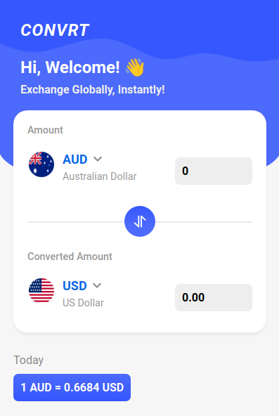

# Convrt Currency Converter

## Table of Contents
- [About The Project](#about-the-project)
- [Built With](#built-with)
- [Screenshots](#screenshots)
- [Features](#features)

## About The Project
An intuitive and user-friendly Google Chrome extension for real-time currency conversion. 

## Screenshots

### Main Screen

[Back to Top](#convrt-currency-converter)

## Built With

[Back to Top](#convrt-currency-converter)

## Features

- Instant Conversion Between Multiple Currencies
- Features Over 100+ Countries
- Flag Display for Easy Identification
- Robust Search Functionality
- API Integration

[Back to Top](#convrt-currency-converter)

